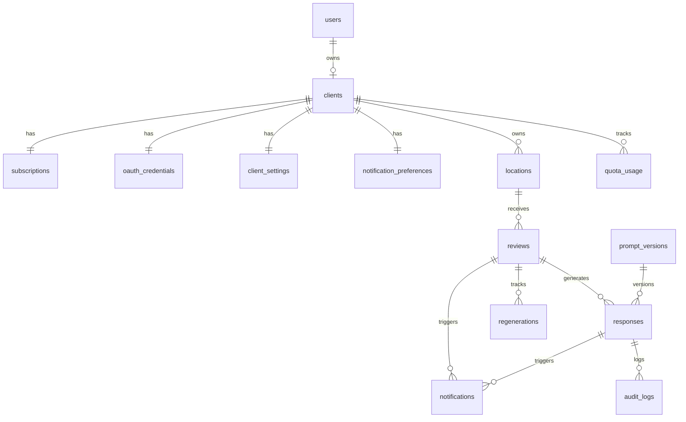

# 01 — Conception de la base de données

Document de référence du modèle de données du SaaS. Toutes les tables, contraintes, index et stratégies de chiffrement sont décrits ici. Les classes SQLAlchemy 2.0 fournies en annexe sont prêtes à être collées dans `backend/app/models/`.

## 1. Vue d'ensemble

### Conventions globales

- **PK** : `UUID` v7 (générée en application via `uuid_utils.uuid7`) pour toutes les entités exposées dans une URL ou un payload API. `BigInt` autoincrement pour les tables de log haut volume (`audit_logs`, `notifications`, `webhook_events`).
- **Timestamps** : toutes les tables ont `created_at TIMESTAMPTZ NOT NULL DEFAULT now()`. Les tables modifiables ont aussi `updated_at TIMESTAMPTZ NOT NULL DEFAULT now()` mis à jour via trigger ou côté ORM.
- **Soft delete** : colonne `deleted_at TIMESTAMPTZ` uniquement sur `users`, `clients`, `reviews`, `responses`. Hard delete des autres tables.
- **Enums** : utilisation de `ENUM` Postgres pour les statuts métier stables (statuts pipeline, tiers, canaux). String CHECK pour les enums susceptibles de bouger souvent.
- **Encodage** : UTF-8, collation `und-x-icu`.
- **Timezone** : tout en `TIMESTAMPTZ`, stockage UTC, conversion en heure locale uniquement à l'affichage.

### Diagramme ER



## 2. Entités

### `users`

Compte applicatif (login email/password). Un `user` de rôle `client` est rattaché à exactement un `clients`. Les admins n'ont pas de `clients`.

| Colonne | Type | Contraintes |
|---|---|---|
| `id` | UUID | PK |
| `email` | TEXT | UNIQUE NOT NULL, citext |
| `password_hash` | TEXT | NOT NULL (argon2) |
| `role` | ENUM(`client`,`admin`) | NOT NULL DEFAULT `client` |
| `email_verified_at` | TIMESTAMPTZ | NULL |
| `mfa_enabled` | BOOLEAN | NOT NULL DEFAULT FALSE |
| `last_login_at` | TIMESTAMPTZ | NULL |
| `client_id` | UUID | FK `clients(id)` ON DELETE SET NULL, NULL pour admins |
| `created_at` / `updated_at` / `deleted_at` | TIMESTAMPTZ | |

Index : `users(email) UNIQUE`, `users(client_id)`.

### `clients`

Entité métier — un commerce/PME utilisateur du SaaS.

| Colonne | Type | Contraintes |
|---|---|---|
| `id` | UUID | PK |
| `business_name` | TEXT | NOT NULL |
| `slug` | TEXT | UNIQUE NOT NULL |
| `business_context` | TEXT | NOT NULL DEFAULT '' — champ libre client |
| `tone_instructions` | TEXT | NOT NULL DEFAULT '' — instructions de ton |
| `status` | ENUM(`active`,`paused`,`suspended`) | NOT NULL DEFAULT `active` |
| `onboarding_completed_at` | TIMESTAMPTZ | NULL |
| `created_at` / `updated_at` / `deleted_at` | | |

Index : `clients(slug) UNIQUE`, `clients(status)`.

### `subscriptions`

Abonnement Lemon Squeezy. Un par client.

| Colonne | Type | Contraintes |
|---|---|---|
| `id` | UUID | PK |
| `client_id` | UUID | FK UNIQUE `clients(id)` ON DELETE CASCADE |
| `tier` | ENUM(`starter`,`pro`,`business`) | NOT NULL |
| `status` | ENUM(`trial`,`active`,`past_due`,`cancelled`,`expired`) | NOT NULL |
| `lemonsqueezy_subscription_id` | TEXT | UNIQUE, NULL pendant le trial sans CB |
| `lemonsqueezy_customer_id` | TEXT | NULL |
| `trial_ends_at` | TIMESTAMPTZ | NULL |
| `current_period_start` | TIMESTAMPTZ | NULL |
| `current_period_end` | TIMESTAMPTZ | NULL |
| `cancelled_at` | TIMESTAMPTZ | NULL |
| `monthly_response_quota` | INTEGER | NOT NULL — dérivé du tier mais stocké pour évolution |
| `created_at` / `updated_at` | | |

Index : `subscriptions(client_id) UNIQUE`, `subscriptions(status)`, `subscriptions(lemonsqueezy_subscription_id) UNIQUE WHERE NOT NULL`.

### `quota_usage`

Compteur mensuel d'appels LLM facturés (réussites + regénérations, hors refus IA).

| Colonne | Type | Contraintes |
|---|---|---|
| `id` | UUID | PK |
| `client_id` | UUID | FK `clients(id)` ON DELETE CASCADE |
| `year_month` | CHAR(7) | NOT NULL — format `YYYY-MM` |
| `count` | INTEGER | NOT NULL DEFAULT 0 |
| `last_alert_threshold` | INTEGER | NULL — dernier seuil notifié (80, 100) |

Index : `quota_usage(client_id, year_month) UNIQUE`.

### `oauth_credentials`

Tokens Google chiffrés. Un set par client (le scope `business.manage` couvre toutes les locations).

| Colonne | Type | Contraintes |
|---|---|---|
| `id` | UUID | PK |
| `client_id` | UUID | FK UNIQUE `clients(id)` ON DELETE CASCADE |
| `access_token_encrypted` | BYTEA | NOT NULL — Fernet |
| `refresh_token_encrypted` | BYTEA | NOT NULL — Fernet |
| `scopes` | TEXT[] | NOT NULL |
| `google_account_id` | TEXT | NULL |
| `expires_at` | TIMESTAMPTZ | NOT NULL |
| `status` | ENUM(`active`,`expiring`,`expired`,`revoked`) | NOT NULL DEFAULT `active` |
| `last_refreshed_at` | TIMESTAMPTZ | NULL |
| `last_check_at` | TIMESTAMPTZ | NULL |
| `last_error` | TEXT | NULL |
| `created_at` / `updated_at` | | |

Index : `oauth_credentials(client_id) UNIQUE`, `oauth_credentials(status, expires_at)`.

### `locations`

Établissements Google Business Profile rattachés au client.

| Colonne | Type | Contraintes |
|---|---|---|
| `id` | UUID | PK |
| `client_id` | UUID | FK `clients(id)` ON DELETE CASCADE |
| `google_account_id` | TEXT | NOT NULL |
| `google_location_id` | TEXT | NOT NULL |
| `name` | TEXT | NOT NULL |
| `address` | TEXT | NULL |
| `primary_category` | TEXT | NULL |
| `status` | ENUM(`active`,`paused`) | NOT NULL DEFAULT `active` |
| `created_at` / `updated_at` | | |

Index : `locations(google_location_id) UNIQUE`, `locations(client_id, status)`.

### `reviews`

Avis Google polled depuis l'API.

| Colonne | Type | Contraintes |
|---|---|---|
| `id` | UUID | PK |
| `location_id` | UUID | FK `locations(id)` ON DELETE CASCADE |
| `google_review_id` | TEXT | NOT NULL |
| `reviewer_display_name` | TEXT | NULL |
| `reviewer_first_name` | TEXT | NULL — extrait pour personnalisation |
| `rating` | SMALLINT | NOT NULL CHECK (rating BETWEEN 1 AND 5) |
| `comment` | TEXT | NULL — NULL si avis sans texte |
| `language` | CHAR(2) | NULL — détectée |
| `posted_at` | TIMESTAMPTZ | NOT NULL — `createTime` Google |
| `last_edited_at` | TIMESTAMPTZ | NULL — `updateTime` Google |
| `fetched_at` | TIMESTAMPTZ | NOT NULL |
| `parent_review_id` | UUID | FK `reviews(id)` NULL — pour threads |
| `status` | ENUM (cf. machine à états) | NOT NULL DEFAULT `detected` |
| `block_reason` | TEXT | NULL — raison filtrage regex |
| `created_at` / `updated_at` / `deleted_at` | | |

**Machine à états `reviews.status`** :
`detected` → `filtering` → (`blocked_regex` | `requires_human_validation` | `processing`) → `awaiting_response` → `completed`

Index :
- `reviews(google_review_id) UNIQUE` — déduplication polling
- `reviews(location_id, posted_at DESC)` — historique paginé
- `reviews(status, location_id)` — vue "en attente"
- `reviews(parent_review_id) WHERE parent_review_id IS NOT NULL`

### `responses`

Réponse générée pour un avis. Plusieurs versions possibles par review (regénérations, validation manuelle).

| Colonne | Type | Contraintes |
|---|---|---|
| `id` | UUID | PK |
| `review_id` | UUID | FK `reviews(id)` ON DELETE CASCADE |
| `version` | SMALLINT | NOT NULL DEFAULT 1 |
| `is_active` | BOOLEAN | NOT NULL DEFAULT TRUE — une seule active par review |
| `source` | ENUM(`ai`,`manual_validator`,`manual_client`) | NOT NULL |
| `content` | TEXT | NOT NULL |
| `ai_status` | SMALLINT | NULL — 0/1 du JSON IA, NULL si source manuelle |
| `ai_details` | TEXT | NULL — code nomenclature (cf. `05-prompts.md`) |
| `ai_model` | TEXT | NULL |
| `prompt_version_id` | UUID | FK `prompt_versions(id)` NULL |
| `tokens_input` | INTEGER | NULL |
| `tokens_output` | INTEGER | NULL |
| `status` | ENUM (cf. machine à états) | NOT NULL DEFAULT `draft` |
| `scheduled_at` | TIMESTAMPTZ | NULL |
| `undo_deadline_at` | TIMESTAMPTZ | NULL |
| `published_at` | TIMESTAMPTZ | NULL |
| `failed_at` | TIMESTAMPTZ | NULL |
| `failure_reason` | TEXT | NULL |
| `validated_by_user_id` | UUID | FK `users(id)` NULL |
| `validated_at` | TIMESTAMPTZ | NULL |
| `created_at` / `updated_at` / `deleted_at` | | |

**Machine à états `responses.status`** :
`draft` → (`pending_validation_client` | `pending_validation_team` | `awaiting_publication`) → `scheduled` → `publishing` → (`published` | `failed`) ; transitions latérales `cancelled`, `superseded`.

Index :
- `responses(review_id, version) UNIQUE`
- `responses(review_id) WHERE is_active = TRUE` — accès direct version courante
- `responses(status, scheduled_at) WHERE status = 'scheduled'` — partial pour le dispatcher
- `responses(status) WHERE status IN ('pending_validation_client','pending_validation_team')`

### `regenerations`

Compteur de regénérations par review (limité par tier).

| Colonne | Type | Contraintes |
|---|---|---|
| `id` | UUID | PK |
| `review_id` | UUID | FK `reviews(id)` ON DELETE CASCADE |
| `requested_by_user_id` | UUID | FK `users(id)` NULL |
| `created_at` | | |

Index : `regenerations(review_id, created_at)`.

### `client_settings`

Configuration self-service. Une ligne par client.

| Colonne | Type | Contraintes |
|---|---|---|
| `id` | UUID | PK |
| `client_id` | UUID | FK UNIQUE `clients(id)` ON DELETE CASCADE |
| `polling_frequency_minutes` | INTEGER | NOT NULL DEFAULT 1440 — 24h pour Starter |
| `publish_delay_range` | ENUM(`1h_2h`,`2h_5h`,`5h_1d`,`1d_2d`,`2d_5d`) | NOT NULL DEFAULT `1d_2d` |
| `publish_window_start` | TIME | NOT NULL DEFAULT '09:00' |
| `publish_window_end` | TIME | NOT NULL DEFAULT '21:00' |
| `publish_window_timezone` | TEXT | NOT NULL DEFAULT 'Europe/Paris' |
| `language_override` | CHAR(2) | NULL — si NULL, langue de l'avis |
| `no_text_review_policy` | ENUM(`ignore`,`reply_4_5_only`,`reply_all`) | NOT NULL DEFAULT `reply_4_5_only` |
| `validation_mode` | ENUM(`suggestion`,`team`) | NOT NULL DEFAULT `suggestion` |
| `digest_mode` | BOOLEAN | NOT NULL DEFAULT FALSE |
| `digest_hour` | SMALLINT | NOT NULL DEFAULT 9 |
| `regex_blocklist` | TEXT[] | NOT NULL DEFAULT '{}' |
| `created_at` / `updated_at` | | |

CHECK : `publish_window_end > publish_window_start`.

### `notification_preferences`

| Colonne | Type | Contraintes |
|---|---|---|
| `id` | UUID | PK |
| `client_id` | UUID | FK UNIQUE `clients(id)` ON DELETE CASCADE |
| `primary_channel` | ENUM(`email`,`telegram`,`sms`) | NOT NULL DEFAULT `email` |
| `email_address` | TEXT | NULL — par défaut email du user, override possible |
| `telegram_chat_id` | TEXT | NULL |
| `telegram_verified_at` | TIMESTAMPTZ | NULL |
| `sms_phone` | TEXT | NULL — V2 |
| `created_at` / `updated_at` | | |

### `notifications`

Log de chaque notification émise (audit + retry).

| Colonne | Type | Contraintes |
|---|---|---|
| `id` | BIGSERIAL | PK |
| `client_id` | UUID | FK `clients(id)` ON DELETE CASCADE |
| `event_type` | TEXT | NOT NULL — ex: `response_pending_validation` |
| `channel` | ENUM(`email`,`telegram`,`sms`) | NOT NULL |
| `template_code` | TEXT | NOT NULL |
| `payload` | JSONB | NOT NULL |
| `status` | ENUM(`pending`,`deferred`,`sent`,`failed`) | NOT NULL |
| `related_review_id` | UUID | FK `reviews(id)` NULL |
| `related_response_id` | UUID | FK `responses(id)` NULL |
| `sent_at` | TIMESTAMPTZ | NULL |
| `failed_at` | TIMESTAMPTZ | NULL |
| `error` | TEXT | NULL |
| `attempts` | SMALLINT | NOT NULL DEFAULT 0 |
| `created_at` | | |

Index : `notifications(client_id, created_at DESC)`, `notifications(status) WHERE status IN ('pending','deferred')`.

### `prompt_versions`

Versioning des prompts IA.

| Colonne | Type | Contraintes |
|---|---|---|
| `id` | UUID | PK |
| `version` | TEXT | UNIQUE NOT NULL — ex: `v1.0.0` |
| `system_prompt` | TEXT | NOT NULL |
| `user_prompt_template` | TEXT | NOT NULL |
| `model` | TEXT | NOT NULL — ex: `claude-sonnet-4-6` |
| `temperature` | NUMERIC(3,2) | NOT NULL DEFAULT 0.70 |
| `max_tokens` | INTEGER | NOT NULL DEFAULT 600 |
| `is_active` | BOOLEAN | NOT NULL DEFAULT FALSE |
| `notes` | TEXT | NULL |
| `created_at` | | |

Contrainte d'application : une seule ligne avec `is_active = TRUE` à la fois (index partiel UNIQUE).

### `audit_logs`

Append-only — actions admin et événements sensibles.

| Colonne | Type | Contraintes |
|---|---|---|
| `id` | BIGSERIAL | PK |
| `actor_user_id` | UUID | FK `users(id)` NULL — NULL si système |
| `action` | TEXT | NOT NULL — ex: `response.published`, `response.deleted_on_google` |
| `target_type` | TEXT | NOT NULL — ex: `response`, `review`, `client` |
| `target_id` | UUID | NULL |
| `metadata` | JSONB | NOT NULL DEFAULT '{}' |
| `created_at` | | |

Index : `audit_logs(target_type, target_id, created_at DESC)`, `audit_logs(actor_user_id, created_at DESC)`.

### `dead_letter_jobs`

Jobs Celery échoués définitivement.

| Colonne | Type | Contraintes |
|---|---|---|
| `id` | BIGSERIAL | PK |
| `task_name` | TEXT | NOT NULL |
| `args` | JSONB | NOT NULL |
| `kwargs` | JSONB | NOT NULL |
| `last_error` | TEXT | NOT NULL |
| `traceback` | TEXT | NULL |
| `attempts` | SMALLINT | NOT NULL |
| `failed_at` | TIMESTAMPTZ | NOT NULL |
| `replayed_at` | TIMESTAMPTZ | NULL |

Index : `dead_letter_jobs(task_name, failed_at DESC)`, `dead_letter_jobs(replayed_at) WHERE replayed_at IS NULL`.

### `webhook_events`

Événements Lemon Squeezy reçus, idempotence stricte.

| Colonne | Type | Contraintes |
|---|---|---|
| `id` | BIGSERIAL | PK |
| `provider` | TEXT | NOT NULL DEFAULT `lemonsqueezy` |
| `event_id` | TEXT | NOT NULL |
| `event_type` | TEXT | NOT NULL |
| `payload` | JSONB | NOT NULL |
| `received_at` | TIMESTAMPTZ | NOT NULL DEFAULT now() |
| `processed_at` | TIMESTAMPTZ | NULL |
| `processing_error` | TEXT | NULL |

Index : `webhook_events(provider, event_id) UNIQUE`.

## 3. Stratégie de chiffrement

Les colonnes `oauth_credentials.access_token_encrypted` et `oauth_credentials.refresh_token_encrypted` sont chiffrées en application via Fernet (cryptography). La clé est lue depuis `OAUTH_TOKEN_ENCRYPTION_KEY` (32 bytes URL-safe base64). Rotation possible en provisionnant une seconde clé `OAUTH_TOKEN_ENCRYPTION_KEY_OLD` et en migrant.

Aucun token ne doit jamais transiter en clair dans les logs. Le wrapper SQLAlchemy `EncryptedString` (cf. annexe) gère la conversion transparente.

## 4. Soft delete et RGPD

Les entités RGPD-sensibles ont `deleted_at` :
- `users` — droit à l'oubli sur le compte
- `clients` — résiliation
- `reviews` / `responses` — données personnelles des reviewers Google

Job `purge_expired_data` (Celery beat quotidien) :
1. Sélectionne les `clients WHERE deleted_at < now() - interval '30 days'`
2. Cascade suppression hard (toutes les FK ON DELETE CASCADE pointant sur `clients` font le travail)
3. Audit log d'une entrée `client.purged` avec `client_id`

Pour l'export RGPD, fournir un endpoint `GET /api/v1/me/export` qui dump le client + locations + reviews + responses + notifications en JSON.

## 5. Stratégie d'indexation

Récap des index critiques pour les performances :

| Requête | Index utilisé |
|---|---|
| Polling : "ai-je déjà cet avis Google ?" | `reviews(google_review_id) UNIQUE` |
| Dashboard : historique paginé d'une location | `reviews(location_id, posted_at DESC)` |
| Page "En attente" | `reviews(status, location_id)` partial sur statuts en attente |
| Dispatcher publication | `responses(status, scheduled_at) WHERE status='scheduled'` |
| Refresh OAuth | `oauth_credentials(status, expires_at)` |
| Quota check | `quota_usage(client_id, year_month) UNIQUE` |
| Idempotence webhook | `webhook_events(provider, event_id) UNIQUE` |
| Lookup user | `users(email) UNIQUE` |

Pas d'index "au cas où". Tout index est justifié par une requête connue.

## 6. Migrations Alembic

Convention : `YYYYMMDD_HHMM_<short_description>.py`. Exemple : `20260501_1200_init_users_clients.py`.

Ordre des migrations initiales (Phase 2/3) :

1. `init_users_clients` — `users`, `clients`
2. `init_subscriptions_quota` — `subscriptions`, `quota_usage`, `webhook_events`
3. `init_oauth_locations` — `oauth_credentials`, `locations`
4. `init_reviews_responses` — `reviews`, `responses`, `regenerations`, `prompt_versions`
5. `init_notifications` — `notification_preferences`, `notifications`
6. `init_settings` — `client_settings`
7. `init_audit_dlq` — `audit_logs`, `dead_letter_jobs`

Toutes les migrations suivantes doivent être idempotentes côté upgrade, et fournir un `downgrade()` testable. Pas de `op.execute("ALTER ...")` non réversible sans justification commentée.

## 7. Annexe — Modèles SQLAlchemy 2.0

Squelettes prêts à coller dans `backend/app/models/`. Imports communs :

```python
from __future__ import annotations

import uuid
from datetime import datetime, time
from typing import Optional

from sqlalchemy import (
    BigInteger, Boolean, CheckConstraint, ForeignKey, Index, Integer,
    Numeric, SmallInteger, String, Text, UniqueConstraint, text,
)
from sqlalchemy.dialects.postgresql import ARRAY, BYTEA, ENUM, JSONB, TIMESTAMP, UUID
from sqlalchemy.orm import DeclarativeBase, Mapped, mapped_column, relationship


class Base(DeclarativeBase):
    pass


class TimestampMixin:
    created_at: Mapped[datetime] = mapped_column(
        TIMESTAMP(timezone=True), nullable=False, server_default=text("now()")
    )
    updated_at: Mapped[datetime] = mapped_column(
        TIMESTAMP(timezone=True),
        nullable=False,
        server_default=text("now()"),
        onupdate=text("now()"),
    )


class SoftDeleteMixin:
    deleted_at: Mapped[Optional[datetime]] = mapped_column(
        TIMESTAMP(timezone=True), nullable=True
    )
```

### `EncryptedString` — wrapper Fernet

```python
# backend/app/security/encryption.py
from cryptography.fernet import Fernet
from sqlalchemy.types import TypeDecorator
from sqlalchemy.dialects.postgresql import BYTEA

from app.config import settings

_fernet = Fernet(settings.oauth_token_encryption_key.encode())


class EncryptedString(TypeDecorator):
    impl = BYTEA
    cache_ok = True

    def process_bind_param(self, value, dialect):
        if value is None:
            return None
        return _fernet.encrypt(value.encode("utf-8"))

    def process_result_value(self, value, dialect):
        if value is None:
            return None
        return _fernet.decrypt(bytes(value)).decode("utf-8")
```

### `Review` (extrait représentatif)

```python
# backend/app/models/review.py
import uuid_utils as uuid_v7

review_status_enum = ENUM(
    "detected", "filtering", "blocked_regex", "requires_human_validation",
    "processing", "awaiting_response", "completed",
    name="review_status",
    create_type=True,
)


class Review(Base, TimestampMixin, SoftDeleteMixin):
    __tablename__ = "reviews"

    id: Mapped[uuid.UUID] = mapped_column(
        UUID(as_uuid=True), primary_key=True, default=uuid_v7.uuid7
    )
    location_id: Mapped[uuid.UUID] = mapped_column(
        UUID(as_uuid=True),
        ForeignKey("locations.id", ondelete="CASCADE"),
        nullable=False,
    )
    google_review_id: Mapped[str] = mapped_column(Text, nullable=False)
    reviewer_display_name: Mapped[Optional[str]] = mapped_column(Text)
    reviewer_first_name: Mapped[Optional[str]] = mapped_column(Text)
    rating: Mapped[int] = mapped_column(SmallInteger, nullable=False)
    comment: Mapped[Optional[str]] = mapped_column(Text)
    language: Mapped[Optional[str]] = mapped_column(String(2))
    posted_at: Mapped[datetime] = mapped_column(TIMESTAMP(timezone=True), nullable=False)
    last_edited_at: Mapped[Optional[datetime]] = mapped_column(TIMESTAMP(timezone=True))
    fetched_at: Mapped[datetime] = mapped_column(TIMESTAMP(timezone=True), nullable=False)
    parent_review_id: Mapped[Optional[uuid.UUID]] = mapped_column(
        UUID(as_uuid=True), ForeignKey("reviews.id", ondelete="SET NULL")
    )
    status: Mapped[str] = mapped_column(review_status_enum, nullable=False, default="detected")
    block_reason: Mapped[Optional[str]] = mapped_column(Text)

    location = relationship("Location", back_populates="reviews")
    responses = relationship(
        "Response", back_populates="review", cascade="all, delete-orphan",
        order_by="Response.version",
    )

    __table_args__ = (
        CheckConstraint("rating BETWEEN 1 AND 5", name="reviews_rating_range"),
        UniqueConstraint("google_review_id", name="reviews_google_review_id_uniq"),
        Index("ix_reviews_location_posted", "location_id", "posted_at"),
        Index("ix_reviews_status_location", "status", "location_id"),
    )
```

### `Response` (extrait représentatif)

```python
# backend/app/models/response.py
response_status_enum = ENUM(
    "draft", "pending_validation_client", "pending_validation_team",
    "awaiting_publication", "scheduled", "publishing", "published",
    "failed", "cancelled", "superseded",
    name="response_status",
    create_type=True,
)
response_source_enum = ENUM(
    "ai", "manual_validator", "manual_client",
    name="response_source", create_type=True,
)


class Response(Base, TimestampMixin, SoftDeleteMixin):
    __tablename__ = "responses"

    id: Mapped[uuid.UUID] = mapped_column(UUID(as_uuid=True), primary_key=True, default=uuid_v7.uuid7)
    review_id: Mapped[uuid.UUID] = mapped_column(
        UUID(as_uuid=True), ForeignKey("reviews.id", ondelete="CASCADE"), nullable=False
    )
    version: Mapped[int] = mapped_column(SmallInteger, nullable=False, default=1)
    is_active: Mapped[bool] = mapped_column(Boolean, nullable=False, default=True)
    source: Mapped[str] = mapped_column(response_source_enum, nullable=False)
    content: Mapped[str] = mapped_column(Text, nullable=False)
    ai_status: Mapped[Optional[int]] = mapped_column(SmallInteger)
    ai_details: Mapped[Optional[str]] = mapped_column(Text)
    ai_model: Mapped[Optional[str]] = mapped_column(Text)
    prompt_version_id: Mapped[Optional[uuid.UUID]] = mapped_column(
        UUID(as_uuid=True), ForeignKey("prompt_versions.id")
    )
    tokens_input: Mapped[Optional[int]] = mapped_column(Integer)
    tokens_output: Mapped[Optional[int]] = mapped_column(Integer)
    status: Mapped[str] = mapped_column(response_status_enum, nullable=False, default="draft")
    scheduled_at: Mapped[Optional[datetime]] = mapped_column(TIMESTAMP(timezone=True))
    undo_deadline_at: Mapped[Optional[datetime]] = mapped_column(TIMESTAMP(timezone=True))
    published_at: Mapped[Optional[datetime]] = mapped_column(TIMESTAMP(timezone=True))
    failed_at: Mapped[Optional[datetime]] = mapped_column(TIMESTAMP(timezone=True))
    failure_reason: Mapped[Optional[str]] = mapped_column(Text)
    validated_by_user_id: Mapped[Optional[uuid.UUID]] = mapped_column(
        UUID(as_uuid=True), ForeignKey("users.id")
    )
    validated_at: Mapped[Optional[datetime]] = mapped_column(TIMESTAMP(timezone=True))

    review = relationship("Review", back_populates="responses")

    __table_args__ = (
        UniqueConstraint("review_id", "version", name="responses_review_version_uniq"),
        Index(
            "ix_responses_scheduled_dispatch",
            "status", "scheduled_at",
            postgresql_where=text("status = 'scheduled'"),
        ),
        Index(
            "ix_responses_pending_validation",
            "status",
            postgresql_where=text(
                "status IN ('pending_validation_client','pending_validation_team')"
            ),
        ),
    )
```

### `OAuthCredential`

```python
# backend/app/models/oauth_credential.py
from app.security.encryption import EncryptedString

oauth_status_enum = ENUM(
    "active", "expiring", "expired", "revoked",
    name="oauth_status", create_type=True,
)


class OAuthCredential(Base, TimestampMixin):
    __tablename__ = "oauth_credentials"

    id: Mapped[uuid.UUID] = mapped_column(UUID(as_uuid=True), primary_key=True, default=uuid_v7.uuid7)
    client_id: Mapped[uuid.UUID] = mapped_column(
        UUID(as_uuid=True),
        ForeignKey("clients.id", ondelete="CASCADE"),
        nullable=False, unique=True,
    )
    access_token: Mapped[str] = mapped_column("access_token_encrypted", EncryptedString, nullable=False)
    refresh_token: Mapped[str] = mapped_column("refresh_token_encrypted", EncryptedString, nullable=False)
    scopes: Mapped[list[str]] = mapped_column(ARRAY(Text), nullable=False)
    google_account_id: Mapped[Optional[str]] = mapped_column(Text)
    expires_at: Mapped[datetime] = mapped_column(TIMESTAMP(timezone=True), nullable=False)
    status: Mapped[str] = mapped_column(oauth_status_enum, nullable=False, default="active")
    last_refreshed_at: Mapped[Optional[datetime]] = mapped_column(TIMESTAMP(timezone=True))
    last_check_at: Mapped[Optional[datetime]] = mapped_column(TIMESTAMP(timezone=True))
    last_error: Mapped[Optional[str]] = mapped_column(Text)

    __table_args__ = (
        Index("ix_oauth_status_expires", "status", "expires_at"),
    )
```

Les autres modèles (`User`, `Client`, `Subscription`, `Location`, `ClientSettings`, etc.) suivent le même pattern : `Base + TimestampMixin (+ SoftDeleteMixin)`, `Mapped[...]` typé, FK avec `ondelete`, index dans `__table_args__`.
