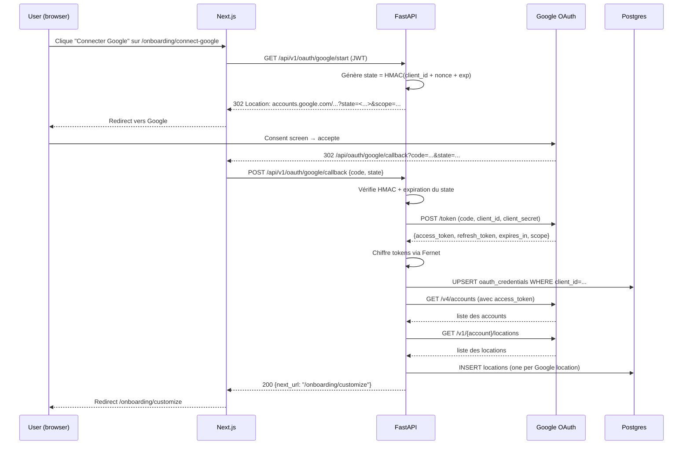
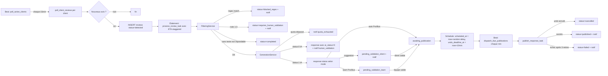
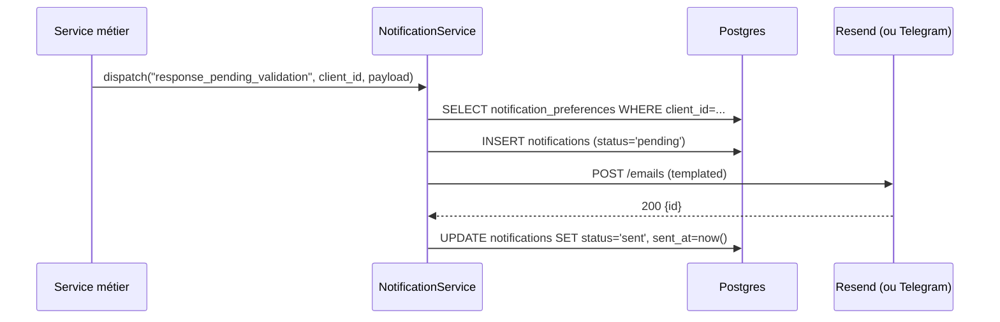
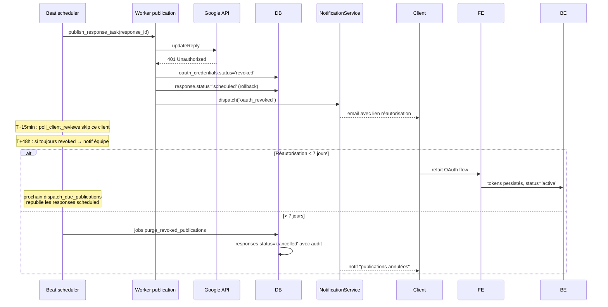

# 04 — Flux critiques

Décrit les quatre flux structurants du système : OAuth Google Business Profile, pipeline polling → publication, notifications multi-canal, gestion des erreurs et retries. Chaque flux inclut un diagramme de séquence, les transitions de statut impactées et les cas d'erreur.

## 1. Flow OAuth Google Business Profile

### Objectif

Obtenir et maintenir un `refresh_token` Google permettant au backend d'appeler l'API Google Business Profile pour le compte du client. C'est un OAuth de **service** (pas un login), distinct de l'auth applicative NextAuth.

### Scopes demandés

- `https://www.googleapis.com/auth/business.manage` — accès complet aux locations, avis et réponses.

> **Point à vérifier en pré-lancement** : confirmer que ce scope unique couvre `accounts.list`, `accounts.locations.list`, `accounts.locations.reviews.list`, `accounts.locations.reviews.updateReply` et `accounts.locations.reviews.deleteReply`. Cette justification fera partie du dossier de validation OAuth Google.

### Diagramme de séquence — initialisation



### Statuts impactés

- `oauth_credentials.status`: insertion en `active`
- `locations.status`: insertion en `active`
- `clients.onboarding_completed_at` : reste NULL (set après l'étape customize)

### Refresh proactif

Job Celery `refresh_expiring_tokens` (toutes les 30 min) :

1. Sélectionne `oauth_credentials WHERE status='active' AND expires_at < now() + interval '1 hour'`
2. Appelle `POST /token` avec `grant_type=refresh_token`
3. Si succès : update `access_token_encrypted`, `expires_at`, `last_refreshed_at`. Statut reste `active`.
4. Si `invalid_grant` : statut → `revoked`, déclenche notif `oauth_revoked`, met `polling` en pause.

### Cas d'erreur

| Cas | Détection | Action |
|---|---|---|
| `state` invalide ou expiré | HMAC fail ou `exp < now()` | 400 Bad Request, log warning, redirect `/onboarding/connect-google?error=invalid_state` |
| `code` rejeté par Google | 400 sur `/token` | 400 vers le client, message i18n `oauth.code_rejected` |
| Pas de location renvoyée | liste vide | Insert credentials quand même, redirect `/onboarding/customize?warning=no_locations`. Le client peut ajouter des locations plus tard |
| Refresh échoue (`invalid_grant`) | 400 sur `/token` | `oauth_credentials.status='revoked'`, notif client, pause polling |
| Refresh échoue (réseau) | timeout/5xx | retry avec backoff exponentiel via `@with_retry(3, ...)`. Pas de changement de statut |

---

## 2. Flow polling → génération → validation → publication

### Vue d'ensemble

C'est le pipeline central du produit. Il est découpé en **phases indépendantes**, chacune persistant son état, pour qu'une panne sur une phase ne perde pas le travail des autres.



### Phase 1 — Polling

**Trigger** : Beat `poll-active-clients` toutes les 15 min.

```python
# Pseudo-code
@celery_app.task(queue="polling")
def dispatch_pollings():
    now = utc_now()
    eligible = client_repo.list_active_with_due_polling(now)  # selon polling_frequency_minutes
    for client_id in eligible:
        poll_client_reviews.apply_async(args=[client_id], queue="polling")
```

```python
@celery_app.task(queue="polling", autoretry_for=(NetworkError,), max_retries=3, retry_backoff=True)
def poll_client_reviews(client_id):
    creds = oauth_repo.get_active(client_id)
    if not creds: return
    locations = location_repo.list_active(client_id)
    new_reviews = []
    for loc in locations:
        google_reviews = google_adapter.list_reviews(creds.access_token, loc.google_account_id, loc.google_location_id)
        for gr in google_reviews:
            if not review_repo.exists_by_google_id(gr.id):
                review = review_repo.create_from_google(loc.id, gr)
                new_reviews.append(review.id)
    # Étalement
    for i, review_id in enumerate(new_reviews):
        eta = utc_now() + timedelta(minutes=4 + random.uniform(0, 1) + 4 * i)
        process_review_task.apply_async(args=[review_id], eta=eta, queue="generation")
```

**Transitions** : insertion avec `status='detected'`.

### Phase 2 — Filtrage

`FilteringService.classify(review, client_settings)` retourne un `Decision` :

```python
# enum
class FilterDecision:
    BLOCKED_REGEX        # match dans regex_blocklist
    REQUIRES_HUMAN       # rating ∈ [1,2,3] OU policy "no text reply forbidden"
    SKIP_NO_REPLY        # avis sans texte et policy=ignore
    PROCEED              # tout va bien, route vers IA
```

Règles dans l'ordre :

1. Si `comment` est NULL : applique `client_settings.no_text_review_policy`
   - `ignore` → `SKIP_NO_REPLY` → review `status='completed'`
   - `reply_4_5_only` et rating ≥ 4 → `PROCEED` (réponse standardisée courte par template, pas d'IA)
   - `reply_all` → `PROCEED` (template court)
2. Si `regex_blocklist` match `comment` (case-insensitive) → `BLOCKED_REGEX` → `status='blocked_regex'`, `block_reason` rempli, notif `review_blocked_regex`.
3. Si `rating ∈ [1,2,3]` → `REQUIRES_HUMAN` → `status='requires_human_validation'`, notif `review_negative_requires_validation`.
4. Sinon → `PROCEED`.

**Note importante** : pour les avis sans texte avec policy `reply_4_5_only`/`reply_all`, on **n'appelle pas l'IA**. On utilise un template fixe (`"Merci pour votre note {{rating}} étoiles !"`) pour économiser le quota et éviter une réponse incongrue.

### Phase 3 — Génération

```python
# pseudo-code de GenerationService.generate(review)
def generate(review_id):
    review = review_repo.get(review_id)
    client = client_repo.get(review.location.client_id)

    # 1. Quota check
    if not quota_service.consume_if_available(client.id):
        notification_service.dispatch("quota_exhausted", client.id, payload)
        return  # review reste en status='processing', sera reprise au reset mensuel

    # 2. Construction du prompt (cf. 05-prompts.md)
    prompt_version = prompt_repo.get_active()
    user_prompt = render_user_prompt(prompt_version.user_prompt_template, review, client)

    # 3. Appel Claude
    try:
        ai = llm_provider.generate_response(
            system_prompt=prompt_version.system_prompt,
            user_prompt=user_prompt,
            max_tokens=prompt_version.max_tokens,
            temperature=float(prompt_version.temperature),
        )
    except LLMError:
        # erreur technique → response avec ai_status=0, ai_details='generation_error'
        response_repo.create_failure(review_id, "generation_error", prompt_version.id)
        notification_service.dispatch("generation_error", client.id, ...)
        review_repo.set_status(review_id, "requires_human_validation")
        return

    # 4. Persistence
    response = response_repo.create_from_ai(review_id, ai, prompt_version.id)

    # 5. Routing post-génération
    if ai.status == 0:
        # IA refuse → toujours validation humaine
        response_repo.set_status(response.id, "pending_validation_team")
        notification_service.dispatch_for_ai_refusal(client.id, response, ai.details)
    else:
        route_response_per_mode(client, response)
```

**Transitions** : `review.status` passe `processing` → `awaiting_response`. Création `response` en `draft` puis transition immédiate selon le routage.

### Phase 4 — Routage par mode de validation

```python
def route_response_per_mode(client, response):
    settings = client_settings_repo.get(client.id)
    sub = subscription_repo.get(client.id)

    # règle non-négociable : note 1-3 = team validation (déjà filtrée en amont,
    # mais double check au cas où)
    if response.review.rating <= 3:
        response_repo.set_status(response.id, "pending_validation_team")
    elif settings.validation_mode == "team" and sub.tier in ("pro", "business"):
        response_repo.set_status(response.id, "pending_validation_team")
    elif settings.validation_mode == "suggestion":
        response_repo.set_status(response.id, "pending_validation_client")
        notification_service.dispatch("response_pending_validation", client.id, payload)
    else:
        # plan auto (futur, hors MVP), sinon traité comme suggestion
        response_repo.set_status(response.id, "pending_validation_client")
        notification_service.dispatch("response_pending_validation", client.id, payload)
```

### Phase 5 — Validation et programmation

Quand le client (ou l'équipe) valide via `POST /api/v1/responses/{id}/approve` :

1. `PublicationService.schedule(response_id, validator_user)` :
   - Vérifie le statut éligible
   - Calcule `scheduled_at = compute_publish_at(now, settings.publish_delay_range, settings.publish_window_*)` :
     - tirage aléatoire dans la fourchette du délai
     - si tombe hors fenêtre publication, recale au prochain créneau valide
   - `undo_deadline_at = now + interval '10 minutes'`
   - Transition `status='scheduled'`
   - `validated_by_user_id = validator_user.id`, `validated_at = now`
2. Notification `response_scheduled` au client (avec lien "annuler" qui marche jusqu'à `undo_deadline_at`).

### Phase 6 — Publication

**Trigger** : Beat `publication-dispatcher` toutes les minutes.

```python
@celery_app.task(queue="publication")
def dispatch_due_publications():
    due = response_repo.list_due_for_publication(now=utc_now())
    for resp_id in due:
        publish_response_task.apply_async(args=[resp_id], queue="publication")


@celery_app.task(queue="publication", autoretry_for=(NetworkError, GoogleApi5xx),
                  max_retries=3, retry_backoff=True, retry_backoff_max=1800)
def publish_response_task(response_id):
    resp = response_repo.get(response_id)
    if resp.status != "scheduled":  # annulation ou état corrompu
        return
    if resp.undo_deadline_at and utc_now() < resp.undo_deadline_at:
        # safety net : si le dispatcher a sélectionné trop tôt
        return

    response_repo.set_status(resp.id, "publishing")
    creds = oauth_repo.get_active(resp.review.location.client_id)
    if creds is None or creds.status != "active":
        response_repo.set_failure(resp.id, "oauth_unavailable")
        notification_service.dispatch("publish_blocked_oauth", ...)
        return

    try:
        google_adapter.reply_to_review(creds.access_token, resp.review.google_resource_name, resp.content)
    except GoogleApiAuthError:
        oauth_service.mark_revoked(creds)
        response_repo.set_status(resp.id, "scheduled")  # remet en attente
        return
    except GoogleApi4xxClientError as e:
        response_repo.set_failure(resp.id, f"google_4xx: {e.message}")
        notification_service.dispatch("publish_failed", ...)
        return

    response_repo.set_published(resp.id, published_at=utc_now())
    review_repo.set_status(resp.review_id, "completed")
    audit_log_repo.create(action="response.published", target_id=resp.id, ...)
    notification_service.dispatch("response_published", ...)
```

### Statuts impactés (récapitulatif)

| Étape | `reviews.status` | `responses.status` |
|---|---|---|
| Polling | `detected` | — |
| Filtrage | `filtering` → `blocked_regex` / `requires_human_validation` / `processing` | — |
| Génération en cours | `processing` | `draft` |
| IA succès, mode suggestion | `awaiting_response` | `pending_validation_client` |
| IA succès, mode team | `awaiting_response` | `pending_validation_team` |
| IA refus | `awaiting_response` | `pending_validation_team` (ai_status=0) |
| Validation | `awaiting_response` | `scheduled` |
| Publication réussie | `completed` | `published` |
| Publication échouée | `awaiting_response` | `failed` |

---

## 3. Flow notifications multi-canal

### Architecture

```
events.dispatcher
      │
      ▼
NotificationService.dispatch(event_type, client_id, payload)
      │
      ├─► resolve preferences (notification_preferences)
      ├─► resolve template (templates/{event}_{channel}.{html,txt,md})
      ├─► resolve channel adapter (Resend / Telegram / Twilio[V2])
      │
      ▼
mode = "instant" → send_now → INSERT notifications status='sent'/'failed'
mode = "digest"  → INSERT notifications status='deferred'
```

### Événements prévus

| `event_type` | Trigger | Canal | Template |
|---|---|---|---|
| `response_pending_validation` | Réponse IA prête en mode suggestion | client | `pending_validation` |
| `response_scheduled` | Réponse validée et programmée | client | `response_scheduled` (avec lien undo) |
| `response_published` | Publication Google réussie | client | `response_published` |
| `review_blocked_regex` | Filtre regex matché | client | `review_blocked_regex` |
| `review_negative_requires_validation` | Note 1-3 détectée | client + équipe | `review_negative` |
| `oauth_revoked` | Token Google révoqué | client | `oauth_revoked` |
| `oauth_unauthorized_48h` | Token non réautorisé sous 48h | équipe | `oauth_alert_team` |
| `publish_failed` | 3 échecs publication | client | `publish_failed_with_content` |
| `quota_threshold_80` | 80% du quota mensuel atteint | client | `quota_warning` |
| `quota_exhausted` | 100% du quota | client | `quota_exhausted` |
| `generation_error` | Échec technique IA | client + équipe | `generation_error` |

### Mode digest

Si `client_settings.digest_mode = TRUE` :

1. Tous les événements **sauf** ceux marqués prioritaires (`oauth_revoked`, `publish_failed`, `quota_exhausted`) sont insérés en `notifications.status='deferred'`.
2. Job `send-daily-digests` (Beat toutes les 15 min) sélectionne les clients dont l'heure préférée matche `now()` (en local TZ), agrège les `deferred`, envoie une notification unique avec un récap, marque tous les `deferred` agrégés en `sent`.

### Diagramme de séquence — notification simple



### Cas d'erreur

| Cas | Action |
|---|---|
| Resend renvoie 5xx | Retry 3x via `@with_retry`, sinon `notifications.status='failed'`, log Sentry |
| Telegram chat_id invalide | `notifications.status='failed'`, `error='telegram_invalid_chat'`, notif email fallback |
| Aucune préférence configurée | Fallback sur email du `users.email` lié au client |
| Adresse email bounce | Retour Resend webhook → marque `notification_preferences.email_address` comme `bouncing`, notif équipe |

---

## 4. Flow gestion des erreurs et retries

Stratégie globale : **chaque type d'erreur a un comportement explicite**. Pas de catch-all silencieux.

### Matrice de gestion

| Source | Type d'erreur | Détection | Action |
|---|---|---|---|
| Google API | 5xx / réseau | exception `httpx.HTTPError` ou `5xx` | Retry exponentiel max 3 (1m, 5m, 30m). Si épuisé, DLQ + notif équipe |
| Google API | 401 / 403 | status code | `oauth_credentials.status='expired'` ou `'revoked'`, pause polling client, notif client `oauth_revoked` |
| Google API | 429 (rate limit) | status code + header `Retry-After` | Sleep selon `Retry-After`, retry max 3, sinon DLQ |
| Google API | 4xx client (autre) | status code | Pas de retry. `responses.status='failed'`, notif `publish_failed` avec body Google |
| Claude API | timeout réseau | httpx | Retry 2x, sinon `ai_status=0`, `ai_details='generation_error'`, route validation humaine |
| Claude API | 5xx | status code | Idem timeout |
| Claude API | 4xx (clé invalide, quota Anthropic) | status code | Pas de retry. Notif équipe critique. Bloque le pipeline `generation` (circuit breaker) |
| Claude API | refus structuré (`status:0`) | parsing JSON | Pas de retry. `responses.ai_status=0` + `ai_details=<code>`, route validation humaine selon nomenclature (cf. 05-prompts.md) |
| Claude API | JSON malformé | parsing | Retry 1x ; si échec, `ai_details='generation_error'`, validation humaine |
| Lemon Squeezy webhook | signature invalide | HMAC fail | 401 immédiat, log warning |
| Lemon Squeezy webhook | doublon | `webhook_events.event_id` déjà présent | 200 OK (idempotent), pas de retraitement |
| Lemon Squeezy webhook | erreur de traitement interne | exception dans handler | 500, Lemon Squeezy retry naturellement |
| Resend / Telegram | 5xx / timeout | httpx | Retry exponentiel max 3 |
| Resend / Telegram | 4xx (config invalide) | status code | `notifications.status='failed'`, fallback email si possible |
| DB | deadlock | `OperationalError` | Retry transaction max 3 |
| Token de réautorisation > 7j | scheduler | `oauth_credentials.status='revoked' AND updated_at < now() - 7d` | Toutes les `responses.status='scheduled'` du client passent en `cancelled`, audit, notif client |

### Implémentation des retries Celery

Toutes les tâches utilisent `autoretry_for`, `max_retries`, `retry_backoff=True`, `retry_backoff_max=1800`. Exemple :

```python
@celery_app.task(
    bind=True,
    queue="publication",
    autoretry_for=(NetworkError, GoogleApi5xx, GoogleRateLimit),
    retry_backoff=True,
    retry_backoff_max=1800,
    max_retries=3,
)
def publish_response_task(self, response_id):
    ...
```

Le handler `task_failure_signal` insère dans `dead_letter_jobs` quand `self.request.retries >= max_retries`.

### Token expiré — chronologie complète



### Circuit breakers

Un circuit breaker par intégration externe :

| Intégration | `fail_max` | `reset_timeout` | Comportement quand ouvert |
|---|---|---|---|
| `google_business` | 5 | 60s | Tâches retry plus tard, pas de DLQ immédiate |
| `claude` | 3 | 120s | Génération suspendue, reviews attendent en `processing` |
| `lemonsqueezy` | 5 | 60s | Webhooks renvoient 503 (Lemon Squeezy retry) |
| `resend` | 5 | 60s | Notifications fallback Telegram si dispo, sinon défèrement |

### Surveillance des erreurs

- **Sentry** : tous les `logger.exception` et failures Celery non gérées y remontent.
- **Dashboard admin `/admin/monitoring`** : vue temps réel sur `dead_letter_jobs`, `oauth_credentials.status NOT IN ('active','expiring')`, taux de `responses.status='failed'` sur 24h, latence moyenne pipeline.
- **Alerting** : règles UptimeRobot sur `/health` + endpoint custom `/internal/metrics` (latence DB, queue depth) protégé par token.
